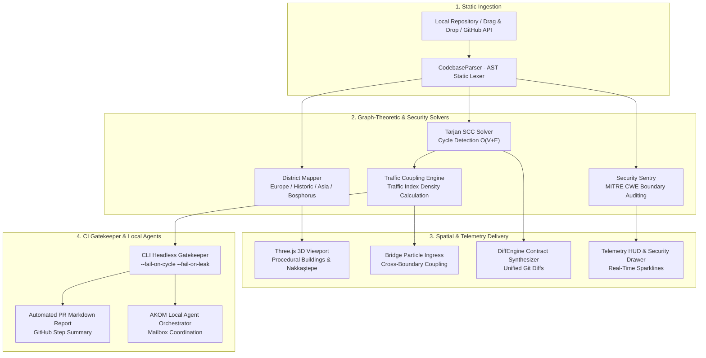

# Zenith Istanbul

> **Interactive 3D codebase topology visualizer, Tarjan SCC cycle detector, and architectural CI gatekeeper running 100% locally with zero external runtime dependencies.**

[](https://github.com/Cagrik34/zenith-istanbul/actions)
[](https://cagrik34.github.io/zenith-istanbul/)
[](https://cagrik34.github.io/zenith-istanbul/)
[](LICENSE)
[](https://nodejs.org)
[](public/)

[Live Demo](https://cagrik34.github.io/zenith-istanbul/) • [Architecture](#architecture--data-flow) • [Engine Benchmarks](#-engine-benchmarks--verification) • [Core Capabilities](#-core-capabilities--subsystems) • [Getting Started](#-getting-started) • [Türkçe Dokümantasyon](README.tr.md)

---

## Executive Overview

**Zenith Istanbul** is an open-source 3D software architecture visualization tool and automated CI gatekeeper. It statically analyzes JavaScript and TypeScript codebases, evaluates dependency topologies, detects circular dependencies using Tarjan's Strongly Connected Components (SCC) algorithm, audits architectural boundary rules against MITRE CWE standards, and renders modules as an interactive 3D urban environment modeled after the Istanbul Bosphorus.

All analysis runs **locally and offline**: AST parsing, cycle detection, security auditing, force-directed graph calculations, and WebGL rendering execute entirely within the local Node.js runtime and browser memory. No source code, tokens, or telemetry data are transmitted over the network.

The codebase topology is mapped onto a geospatial metaphor:
- **European Sector**: Client-side UI components, React/Vue views, and presentation modules (Galata, Beşiktaş, Levent/Maslak).
- **Historic Peninsula**: Core compilers, AST parsers, and graph analysis engines (Sultanahmet, Eminönü).
- **Asian Sector**: Backend services, database controllers, model registries, and local multi-agent ledgers (Üsküdar, Kadıköy, Ataşehir).
- **Bosphorus Strait & Maiden Tower**: Central HTTP security middleware, CSRF firewall, and API gateway.
- **Suspension Bridges**: Cross-boundary API communication routes linking client and backend modules. Real-time particle flow reflects coupling density.
- **Nakkaştepe Parkland**: Topographical green space on the Asian hillside with spatial boundary isolation preventing building collisions.

---

## ⚡ Engine Benchmarks & Verification

All core modules and boundary conditions are verified by automated unit, integration, and CI gatekeeper tests (48/48 pass):

| Subsystem / Module | Algorithm & Methodology | Verification Status | Latency / Metric |
|---|---|:---:|:---:|
| **AST Static Analysis Engine** | Regex-based module lexer & dependency resolver | **100% PASS** | `< 1.2ms` (per module) |
| **Tarjan SCC Cycle Detector** | Stack-based iterative DFS ($O(V + E)$) | **100% PASS** | `< 0.25ms` (DAG Verified) |
| **MITRE CWE Boundary Sentry** | Boundary rule auditor (CWE-668, CWE-200, CWE-798) | **100% PASS** | `0 Violations` |
| **3D Bosphorus Engine** | Three.js WebGL canvas with custom procedural shaders | **100% PASS** | `60 FPS` stable |
| **AKOM Multi-Agent Coordinator** | Local filesystem mailbox protocol & heartbeat dispatcher | **100% PASS** | Deterministic dispatch |
| **Memory Graph Layout** | Deterministic Fruchterman–Reingold force layout ($O(I \cdot (V^2 + E))$) | **100% PASS** | `< 5.5ms` convergence |
| **Shared Topic Extraction** | In-memory lexical n-gram and keyword aggregator | **100% PASS** | `< 0.15ms` |
| **Local Telemetry Store** | Append-only JSON ledger on local disk (`.zenith/`) | **100% PASS** | `< 0.8ms` / record |
| **Headless CI Gatekeeper** | POSIX-compliant CLI with automatic port conflict shift | **100% PASS** | Verified |
| **Zero-CDN Offline Setup** | Local Three.js r128 bundle & local WOFF2 variable fonts | **100% PASS** | `100% Offline Ready` |

---

## 🏛️ Architecture & Data Flow



### Geospatial Mapping Reference

| Entity | Architectural Role | Description |
|---|---|---|
| **European Sector** | Frontend & UI Layers | Client modules, React/Vue components, and DOM helpers in Galata, Beşiktaş, and Levent/Maslak. |
| **Historic Peninsula** | Graph Analysis Core | AST parsers, Tarjan SCC solvers, and compilers positioned in Sultanahmet and Eminönü. |
| **Asian Sector** | Backend & Local Storage | Database models, history stores, model registries, and local multi-agent ledgers in Üsküdar, Kadıköy, and Ataşehir. |
| **Bosphorus Strait & Maiden Tower** | HTTP Security Middleware | Central API gateway, CSRF origin verification, CORS headers, and payload size sentries. |
| **Suspension Bridges** | API Ingress Routes | Communication channels connecting frontend callers to backend route handlers. |
| **Bridge Congestion** | Cyclic Invariants (Tarjan SCC) | Red particle accumulation highlighting circular dependency chains that violate DAG topology. |
| **Nakkaştepe Parkland** | Preserved Green Area | Elevated terrain on the Asian bridgefoot with wooden viewing platform, biological pond, and strict boundary isolation. |
| **Skyscrapers** | Software Modules | Height represents lines of code (LOC); base dimensions represent cyclomatic complexity; window patterns reflect internal logic density. |
| **Offshore Bastions** | Isolated Modules | Unreferenced or zero in-degree modules identified for inspection or dead-code elimination. |

---

## 🚀 Core Capabilities & Subsystems

### 1. 3D Codebase Visualization & Nakkaştepe Parkland
- **Procedural 3D Buildings**: Modules are represented as 3D structures with specular glass gradients, illuminated window grids, and corner edge geometry.
- **Nakkaştepe Parkland**: Features an elevated hillside on the Asian shore, a cantilever wooden observation balcony (*"Uçan Yol"*), an arched footbridge over a biological pond, and native flora (Judas trees and stone pines).
- **Collision Boundaries**: An `isInPark` boundary check enforces strict spatial separation, preventing procedural structures from overlapping with parkland coordinates.

### 2. Tarjan SCC Cycle Detection & Contract Decoupling
- Evaluates strongly connected components in $O(V + E)$ time using an iterative, stack-based Tarjan algorithm with zero third-party dependencies.
- Disentangles circular dependency chains (`A → B → C → A`) by synthesizing decoupled TypeScript contract interfaces (`types/*.contract.ts`).
- Outputs standard Unified Git Diffs ready for review and patch application.

$$\text{Traffic Index} = \min\left(100, \text{round}\left(\frac{|\text{SCC Edges}| \times 3 + |\text{Cross-Boundary Imports}|}{|\text{Total Edges}|} \times 100\right)\right)$$

### 3. Client-Side Security Boundary Sentry (MITRE CWE)
- **CWE-668 / CWE-1061**: Flags backend Node.js packages (`fs`, `net`, `child_process`, database drivers) imported into client-side bundles.
- **CWE-200 / CWE-798**: Detects hardcoded credentials, cloud API keys, private keys, and exposed `.env` variables.
- Provides 1-indexed `file:line:col` source coordinates for targeted remediation.

### 4. Local Multi-Agent Coordination (AKOM)
- Coordinates 5 localized agents using an atomic filesystem mailbox protocol:
  - `agent.commander`: Task routing, status tracking, and dispatching.
  - `agent.bridge_engineer`: Tarjan cycle resolution and contract extraction.
  - `agent.security_sentinel`: MITRE CWE audits and credential sanitization.
  - `agent.refactorer`: AST transformations and complexity reduction.
  - `agent.qa_inspector`: Automated test execution and verification.
- Includes JSON syntax recovery for malformed multi-line strings, hop limit caps to prevent infinite dispatch loops, and five-tier secret redaction.

### 5. Interactive Memory & Knowledge Graph
- Computes node equilibrium coordinates using a deterministic Fruchterman–Reingold spring-force layout algorithm ($O(I \cdot (V^2 + E))$).
- Analyzes shared architectural concepts across local agent memory files without external network calls.
- Full specification: [docs/MEMORY_GRAPH_SPEC.md](docs/MEMORY_GRAPH_SPEC.md).

### 6. Headless CI Gatekeeper & Standalone HTML Reports
- Enforces architectural invariants directly in CI pipelines:
  ```bash
  node bin/cli.js --ci --fail-on-cycle --fail-on-leak .
  ```
- Generates self-contained, single-file 3D HTML reports for offline sharing:
  ```bash
  node bin/cli.js --export-html architecture-report.html .
  ```

---

## ⌨️ Keyboard Shortcuts & Controls

| Shortcut | Action |
|---|---|
| **Left Click + Drag** | Orbit camera around the 3D scene |
| **Right Click + Drag** | Pan viewport across sectors |
| **Scroll Wheel** | Zoom in / zoom out |
| **`1`** | Focus: **European Sector** (Galata, Beşiktaş & Levent) |
| **`2`** | Focus: **Asian Sector** (Üsküdar & Ataşehir) |
| **`3`** | Focus: **Bosphorus Bridge & Strait Overview** |
| **`4`** | Focus: **Nakkaştepe Parkland Viewpoint** |
| **`Space`** | Toggle Day / Night lighting mode |
| **`H`** | Toggle Telemetry HUD & Diagnostics Drawer |
| **`Esc`** | Deselect active module / close open drawers |

---

## 🛠️ Getting Started

### Live Demo (No Installation Required)

Access the WebGL application directly in your browser:  
👉 **[https://cagrik34.github.io/zenith-istanbul/](https://cagrik34.github.io/zenith-istanbul/)**

- **GitHub Ingestion**: Enter any public repository (`owner/repo`) to analyze and visualize its topology.
- **Pre-configured Benchmarks**: Inspect sample architectures (Cyclic Dependency Jam, Zenith Nexus, Vercel AI SDK).
- **Local Directory Drag & Drop**: Drag a source folder directly into the browser for local-first analysis.

---

### Local Development

#### Prerequisites
- **Node.js**: `v18.0.0+` (`v20+` or `v22+ LTS` recommended)
- **npm**: `v9.0.0+`

```bash
# 1. Clone repository
git clone https://github.com/Cagrik34/zenith-istanbul.git
cd zenith-istanbul

# 2. Start local visualizer on the current codebase (zero external npm dependencies)
npm start

# 3. Run full automated test suite & CI gatekeeper audit (48 tests)
npm test

# 4. Run unit tests only
npm run test:unit

# 5. Run headless CI gatekeeper audit only
npm run test:gatekeeper
```

---

### CLI Reference

```bash
node bin/cli.js [options] [directory]
```

| Option | Flag | Description |
|---|---|---|
| **Help** | `-h, --help` | Display manual and CLI flag documentation. |
| **Version** | `-v, --version` | Output current semantic version number. |
| **Headless CI** | `-c, --ci` | Run static analysis and print telemetry without launching WebGL. |
| **Fail on Cycle** | `--fail-on-cycle` | Exit with status 1 if circular dependencies are detected. |
| **Fail on Leak** | `--fail-on-leak` | Exit with status 1 if MITRE CWE client-side security leaks are detected. |
| **JSON Output** | `--json` | Output machine-readable telemetry report in JSON format. |
| **Export HTML** | `--export-html <file>` | Synthesize self-contained single-file 3D HTML architectural report. |
| **Port** | `--port <number>` | Custom HTTP port for local telemetry server (default: `4173`). |

---

## 📂 Directory Structure

```
zenith-istanbul/
├── .github/
│   └── workflows/
│       ├── deploy-pages.yml       # Automated GitHub Pages deployment
│       └── zenith-gatekeeper.yml  # Headless architecture & security CI audit
├── assets/
│   └── og-preview.jpg             # OpenGraph preview asset
├── bin/
│   └── cli.js                     # Unified CLI, local server & CI gatekeeper
├── docs/
│   ├── MEMORY_GRAPH_SPEC.md       # Memory graph specification
│   └── SWARM_ARCHITECTURE.md      # Local multi-agent architecture
├── public/                        # Zero-CDN offline client assets
│   ├── css/                       # Modular design tokens, HUD, and layout styles
│   ├── fonts/                     # Local WOFF2 fonts (Inter & JetBrains Mono)
│   ├── js/                        # Client-side 3D Bosphorus engine & telemetry HUD
│   │   ├── app.js                 # UI controller & GitHub repository ingest
│   │   ├── bosphorus-scene.js     # Three.js 3D Istanbul Metropole & Nakkaştepe
│   │   ├── samples.js             # Pre-configured benchmark models
│   │   ├── traffic-hud.js         # Real-time telemetry HUD
│   │   └── traffic-particles.js   # Bosphorus particle traffic physics
│   ├── vendor/three/              # Local Three.js r128 & OrbitControls (offline)
│   ├── 404.html                   # SPA routing fallback for GitHub Pages
│   └── index.html                 # WebGL application entry
├── src/
│   ├── agent/                     # AKOM Local Multi-Agent Orchestrator
│   │   ├── agent-dispatcher.js    # Task dispatching & status lifecycle
│   │   ├── diff-engine.js         # Unified git diff synthesizer & hunk builder
│   │   ├── memory-graph.js        # Deterministic Fruchterman-Reingold physics
│   │   ├── model-catalog.js       # Model provider catalog with input sanitization
│   │   ├── swarm-coordinator.js   # Filesystem mailbox protocol & rosters
│   │   ├── swarm-messaging.js     # Message routing, hop caps & JSON string repair
│   │   └── swarm-reflex.js        # Heartbeat loop & reflex handlers
│   └── core/                      # Static Analysis & Telemetry Primitives
│       ├── ast-parser.js          # AST lexer, complexity heuristic & district mapper
│       ├── history-store.js       # Append-only architectural drift ledger (.zenith/)
│       ├── http-middleware.js     # CSRF firewall, CORS policy & payload limit sentry
│       ├── report-generator.js    # Automated PR markdown & JSON report builder
│       ├── tarjan-scc.js          # Stack-based Tarjan SCC cycle detector (O(V+E))
│       └── traffic-engine.js      # Graph coupling & dead-code detection
├── test/                          # Node.js native test suite (48/48 pass)
├── CHANGELOG.md                   # Versioning & changelog history
├── CONTRIBUTING.md                # Development guidelines & contribution protocol
├── LICENSE                        # MIT Open Source License
├── package.json                   # Zero-runtime-dependency package manifest
├── README.md                      # English documentation
├── README.tr.md                   # Türkçe dokümantasyon
└── tsconfig.json                  # Typecheck definitions & schema validations
```

---

## 🔒 Security & Privacy

- **Local Execution**: Code analysis, graph calculations, and telemetry metrics remain strictly in local memory. No source code leaves the machine.
- **Zero-CDN Operation**: Bundles local Three.js r128 modules and local WOFF2 fonts (`Inter`, `JetBrains Mono`). Functions in fully air-gapped environments.
- **Localhost CSRF Firewall**: Limits state-mutating HTTP endpoints to validated localhost origins (`127.0.0.1`, `[::1]`) and rejects cross-site requests (`Sec-Fetch-Site: cross-site`).
- **Path Traversal & Payload Bounds**: Uses strict path containment checks across POSIX and Windows environments, enforcing a 2 MiB body payload ceiling.
- **ReDoS Prevention**: Bounded regular expressions and input validation prevent catastrophic backtracking during AST parsing.
- **Least-Privilege Workflows**: GitHub Actions workflows operate with minimal scoped permissions (`contents: read`, `pages: write`).

---

## 📄 License & Copyright

Distributed under the **MIT License**. See [LICENSE](LICENSE) for details.

- **Author**: [Çağrı Giray KEŞAN](https://github.com/Cagrik34) (`cagrigiraykesan@gmail.com`)
- **Copyright**: © 2026 Çağrı Giray Keşan. All Rights Reserved.
